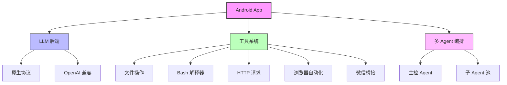
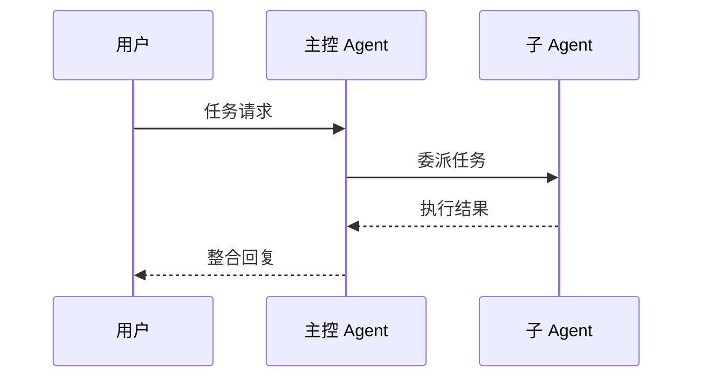

<div align="center">

# AgentToolbox

**Android 上的 AI Agent 工具执行环境**

DeepSeek 聊天客户端 · Bash 解释器 · MCP 工具编译器

[](https://github.com/Aasdqwe1/agent-toolbox-kotlin/actions/workflows/build.yml)
[](https://github.com/Aasdqwe1/agent-toolbox-kotlin/releases)
[](https://developer.android.com/)
[](https://kotlinlang.org/)
[](LICENSE)

</div>

---

## 项目统计

| 指标 | 数值 |
|---|---|
| 模块数 | 7 (`app` / `core` / `data` / `llm` / `tool-compiler` / `mcp-bridge` / `litert`) |
| 工具数量 | 50+ (文件操作 / Bash / HTTP / 浏览器 / 微信 / 子 Agent 等) |
| 子 Agent 类型 | 8 (EXPLORE / EDIT / TEST / DEBUG / DOCS / REVIEW / SEARCH / CHANNEL) |
| 最低版本 | Android 7.0 (API 24+) |
| 构建系统 | Gradle + Kotlin DSL |

---

## 架构概览



**依赖方向**：`:app → :data → :core`，`:app → :llm → :core`，`:app → :mcp-bridge`，`:app → :litert → :llm`，无反向依赖。完整约束与强制校验见 [AGENTS.md](AGENTS.md) §2.2。

---

## 核心能力

### LLM 聊天客户端

```kotlin
// 多轮对话 + 深度思考 + 联网搜索
val client = LLMClientFactory.create(BackendType.NATIVE)
val response = client.chat(
    messages = history,
    thinkingEnabled = true,
    searchEnabled = true
)
```

- 多轮对话上下文维护
- 深度思考模式（推理过程可视化）
- 联网搜索增强
- SSE 流式响应
- Keystore AES-256-GCM 加密存储

---

### Bash 解释器

```bash
# ARM64 静态编译 Bash 5.2.37
./gradlew test          # 运行测试
grep -r "TODO" app/src  # 搜索代码
find . -name "*.kt"     # 查找文件
```

- 静态链接，无外部依赖
- 完整 Shell 语法（管道/重定向/变量/循环）
- 300 秒超时控制
- stdout/stderr 统一捕获

---

### MCP 工具编译器

```kotlin
@Tool(name = "read_file", description = "读取文件内容")
fun readFile(path: String): String {
    return File(path).readText()
}
```

- DSL + 注解两种定义方式
- 编译为可执行代码
- 支持 OpenAI/MCP 双 Schema
- 工具注册表（`Toolbox`）

---

### 多 Agent 编排



- 主控 + 8 种子 Agent
- 工具白名单隔离
- 待办任务推进
- 并行/串行编排

---

### 微信桥接

```
+-----------------+     +-----------------+
|   原生直连通道   |     |  PRoot 官方插件  |
|   (轻量收发)    |     |  (完整路由)      |
+--------+--------+     +--------+--------+
         |                       |
         +-----------+-----------+
                     |
              +------v------+
              |  消息轮询    |
              |  (30s 间隔)  |
              +-------------+
```

- OpenClawWeChat 原生直连
- Debian PRoot 官方插件
- 多账号会话隔离
- 消息轮询接收

---

## 项目结构

```
agent-toolbox-kotlin/
├── app/                  # 主应用模块
│   ├── src/main/java/    #   应用源码（UI / 工具 / Agent / 微信）
│   ├── jni/bash/         #   Bash 5.2.37 静态编译二进制
│   └── src/main/assets/skills/  # 内置技能包
├── core/                 # 核心基础能力（LogStore / ChatMessage / SystemPromptComposer）
├── data/                 # 本地持久化层（LocalStore）
├── llm/                  # LLM 后端与协议适配（DeepSeek 逆向 / OpenAI 兼容）
├── tool-compiler/        # MCP 工具编译器（纯 Kotlin/JVM）
├── mcp-bridge/           # MCP 双向桥（本地工具发射 + 远程工具接收）
├── litert/               # LiteRT-LM 本地模型后端（离线推理）
├── docs/                 # 架构文档
├── scripts/              # 构建辅助脚本
└── gradle/               # Gradle Wrapper
```

---

## 快速开始

```bash
# 克隆项目
git clone https://github.com/Aasdqwe1/agent-toolbox-kotlin.git
cd agent-toolbox-kotlin

# 构建 Debug APK
./gradlew assembleDebug

# 运行单元测试
./gradlew test

# 代码检查
./gradlew ktlintCheck
```

**环境要求**：
- JDK 17+
- Android SDK (compileSdk 34+)
- 设备：Android 7.0+ (API 24+)

---

## 文档入口

| 文档 | 说明 |
|---|---|
| [AGENTS.md](AGENTS.md) | 仓库契约：依赖方向、不许动的东西、改代码固定动作 |
| [tool-compiler/README.md](tool-compiler/README.md) | MCP 工具编译器 API 详解 |
| [scripts/README.md](scripts/README.md) | 构建辅助脚本（aarch64 AAPT2 / Kotlin 自检 / 架构校验） |
| [app/jni/README.md](app/jni/README.md) | JNI 桥接与 Bash 静态编译说明 |
| [app/src/main/assets/skills/](app/src/main/assets/skills/) | 内置技能包文档（Git / Excel / SMB / GitHub Actions 等） |

---

## 贡献

欢迎提交 Issue 和 Pull Request！

**提交流程**：
1. Fork 本仓库
2. 创建特性分支 (`git checkout -b feature/amazing-feature`)
3. 提交更改 (`git commit -m 'feat: add amazing feature'`)
4. 推送分支 (`git push origin feature/amazing-feature`)
5. 打开 Pull Request

**代码规范**：
- 通过 CI 检查 (GitHub Actions)
- 遵守 Kotlin 代码规范 (`ktlint`)
- 新增功能包含单元测试
- 更新相关文档

---

## 版本历史

| 版本 | 日期 | 变更 |
|---|---|---|
| **v1.0.1** | 当前 | 协程重构、Token 加密存储、精简运行时依赖 |
| **v1.0.0** | 2026-07-23 | 初始稳定版：LLM 客户端、Bash、MCP 编译器 |

---

## 许可证

本项目仅供学习和研究参考使用，**严禁任何商业活动和滥用**。

- 禁止将本项目或基于本项目的代码用于商业目的
- 禁止用于任何违法违规活动
- 禁止滥用 DeepSeek 私密 API 或违反其服务条款
- 使用者需自行承担所有法律责任

详见 [LICENSE](LICENSE)。

---

<div align="center">

**维护者**: Aasdqwe1 | **邮箱**: qq3044672287@hotmail.com | **GitHub**: [Aasdqwe1/agent-toolbox-kotlin](https://github.com/Aasdqwe1/agent-toolbox-kotlin)

</div>
